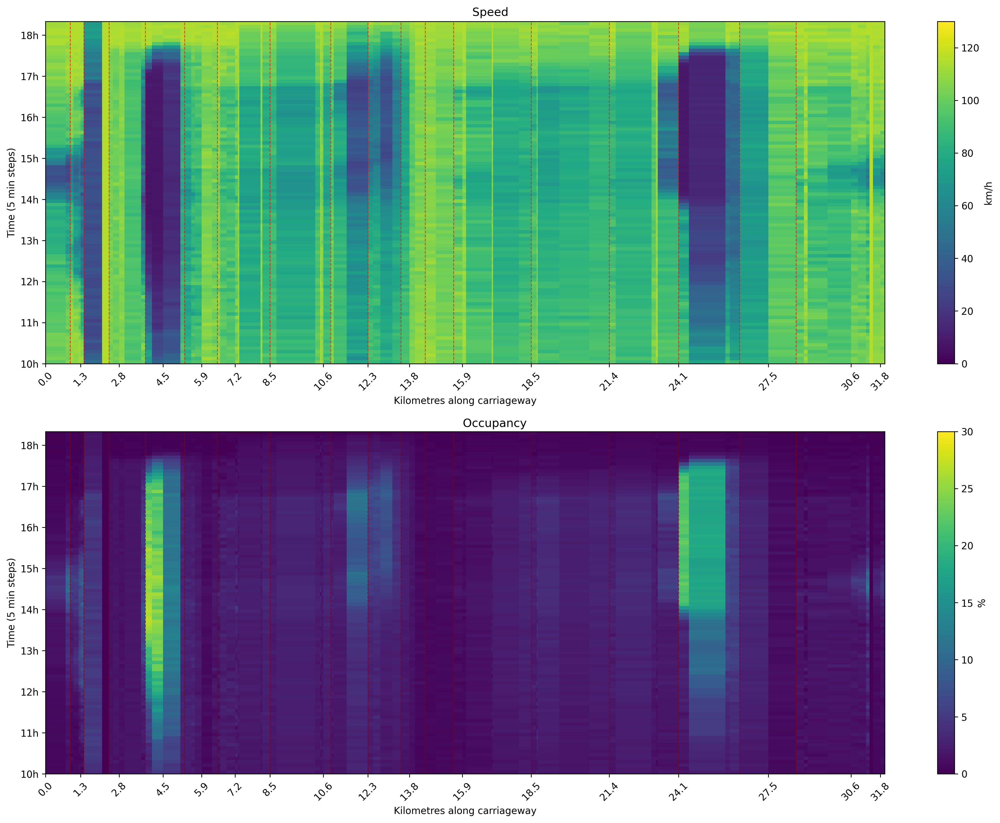
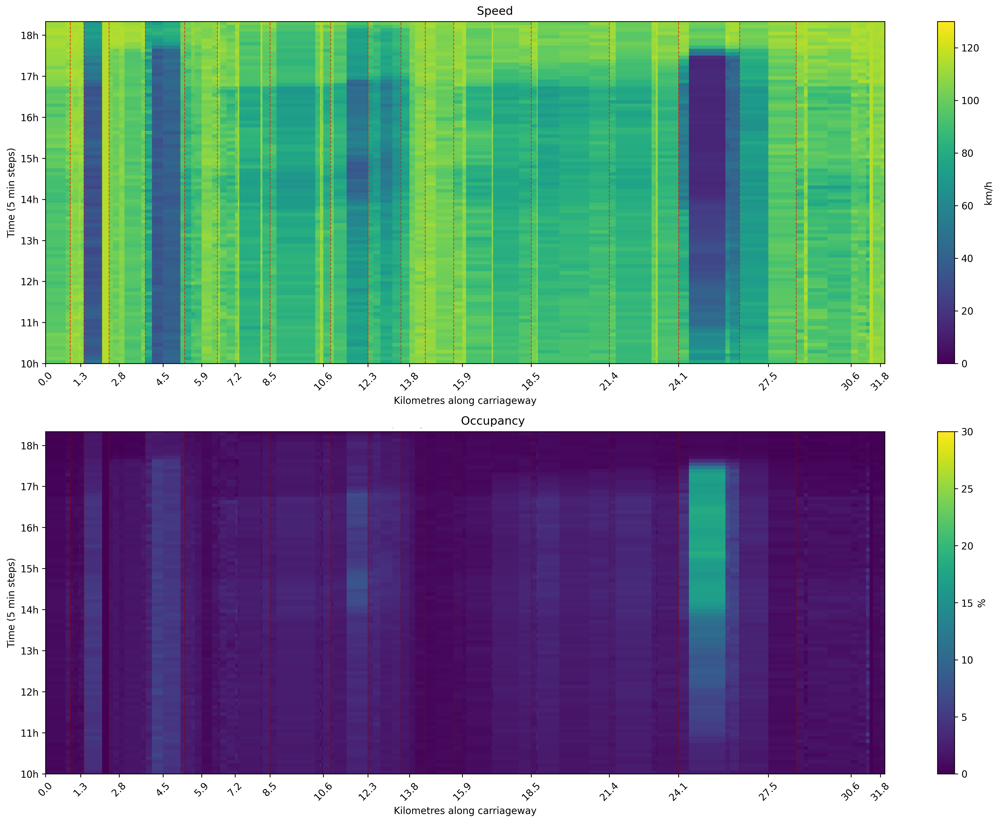

# C-ALINEA – Coordinated Control Algorithm For Fairness In Ramp Metering

## Introduction
This repository contains a Python implementation of a traffic microsimulation to demonstrate the potential of **C-ALINEA**, a coordinated ramp metering controller designed to improve fairness by considering neighboring ramps in addition to the controlled ramp. The repository is based on [SUMO (provided by DLR)](https://sumo.dlr.de).

## Abstract
Highway congestion leads to traffic diversion into cities, increased emissions, and longer travel times. Ramp metering (traffic lights at on-ramps) is an effective way to reduce congestion, but it often faces public opposition due to perceived unfairness — some ramps wait much longer than others.


<table>
<tr>
<td align="center" width="50%">
  <br/>
  <em>Figure 1 – Uncontrolled Highway </em>
</td>
<td align="center" width="50%">
  <br/>
  <em>Figure 2 – Ramp-Metered Highway </em>
</td>
</tr>
</table>


C-ALINEA is an enhanced version of the ALINEA algorithm that balances efficiency and fairness in ramp metering. It employs two distinct coordination methods with varying levels of aggressiveness in neighbor influence. Method M1 uses global normalization across the entire network, while Method M2 applies local normalization based on each ramp's immediate vicinity. For each method, the algorithm can be configured to consider either 1, 2, or 3 neighboring ramps both upstream and downstream, creating a coordination window that ranges from 3 total ramps (N=1) to 7 total ramps (N=3). This flexible neighbor selection allows the algorithm to balance between computational simplicity and coordination effectiveness, with higher N values generally providing more comprehensive network awareness at the cost of increased complexity.

The algorithm addresses multiple dimensions of fairness, including:

- **Utilitarianism:** Maximize overall benefit for all users.  
- **Rawlsian fairness:** Focus on helping the most disadvantaged first.  
- **Harsanyian fairness:** Improve the average experience while treating everyone symmetrically.  
- **Egalitarianism:** Reduce disparities so no ramp experiences excessive delay.  
- **Aristotelian fairness:** Allocate access proportionally based on demand or priority.  

Network-wide coordination considers neighboring ramp flows to avoid over-serving a single ramp and distribute access more evenly across the corridor.


<table>
<tr>
<td align="center" width="50%">
  <br/>
  <em>Figure 3 – Amsterdam Study Case</em>
</td>
<td align="center" width="50%">
  <br/>
  <em>Figure 4 – Ramp Metering Blockscheme</em>
</td>
</tr>
</table>


A microsimulation-based case study on Amsterdam’s A10 Ring Road demonstrates how **C-ALINEA** can substantially improve both efficiency and fairness of highway traffic operations. Unlike traditional ramp metering, C-ALINEA coordinates neighboring ramps to avoid overserving a single entry point and distributes mainline access more evenly across the network.

The simulation results show that the best configuration of C-ALINEA delivers remarkable performance:

- **Efficiency gains:** Total network delay reduced by **58.8%** compared to uncontrolled conditions, outperforming ALINEA (**37.9%**) and METALINE (**42.1%**).  
  Average network speed increased from **47.0 km/h** to **66.7 km/h**, and average per-vehicle delay dropped to just **2.1 minutes** — all while maintaining vehicle throughput (>40,000 vehicles).  

- **Fairness improvements:** Lowest **Gini coefficient** for vehicle distribution (**0.2834**) and delay inequality (**0.1892**), with average delay reduced to **125.4 s** (**56% improvement** over No Control, **30% better** than ALINEA).  

- **Trade-offs:** Higher metering rates (**17.9–25.8% red time** vs. **9.6%** for ALINEA).

C-ALINEA balances network efficiency and equity while remaining lightweight and practical. It preserves ALINEA’s simplicity and robustness, only requiring reliable inter-ramp communication, a simple firmware/software update, and basic integration with existing monitoring systems — no expensive centralized optimization is needed.


## This repository contains the following

```
/
├── code/
│   ├── RunSimulation.py
│   └── ...
├── data/
│   ├── RoadSequence_of_Edges.xlsx
│   └── ...
├── figures/
│   ├── ...
│   └── ...
├── logs/
│   ├── logs_C_ALINEA_M1_N1.zip
│   ├── logs_C_ALINEA_M1_N2.zip
│   ├── logs_C_ALINEA_M1_N3.zip
│   ├── logs_C_ALINEA_M2_N1.zip
│   ├── logs_C_ALINEA_M2_N2.zip
│   ├── logs_C_ALINEA_M2_N3.zip
│   ├── logs_ALINEA.zip
│   ├── logs_METALINE.zip
│   └── logs_NO_CONTROL.zip
└── model/
├── Configuration.sumocfg
├── Network.net.xml
└── ...
```
