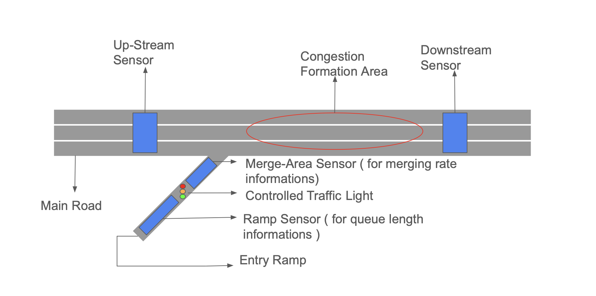

# C-ALINEA – Coordinated Control Algorithm For Fairness In Ramp Metering

## Introduction
This repository contains a Python implementation of a traffic microsimulation to demonstrate the potential of **C-ALINEA**, a coordinated ramp metering controller designed to improve fairness by considering neighboring ramps in addition to the controlled ramp. The repository is based on [SUMO (provided by DLR)](https://sumo.dlr.de).

## Abstract
Highway congestion leads to traffic diversion into cities, increased emissions, and longer travel times. Ramp metering (traffic lights at on-ramps) is an effective way to reduce congestion, but it often faces public opposition due to perceived unfairness — some ramps wait much longer than others.

C-ALINEA is an enhanced version of the ALINEA algorithm that balances efficiency and fairness in ramp metering.  

- **Utilitarianism:** Maximize overall benefit for all users.  
- **Rawlsian fairness:** Focus on helping the most disadvantaged first.  
- **Harsanyian fairness:** Improve the average experience while treating everyone symmetrically.  
- **Egalitarianism:** Reduce disparities so no ramp experiences excessive delay.  
- **Aristotelian fairness:** Allocate access proportionally based on demand or priority.  

Network-wide coordination considers neighboring ramp flows to avoid over-serving a single ramp and distribute access more evenly across the corridor.

  
  

